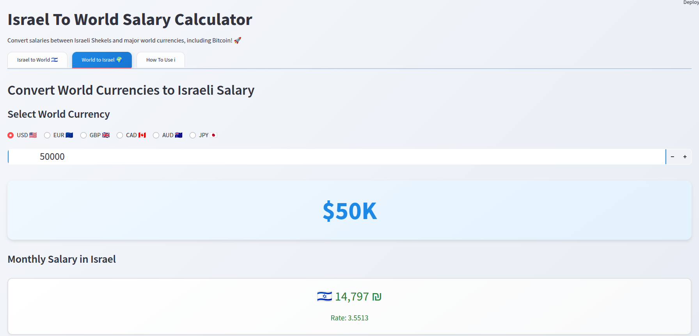

# Israel To World Salary Calculator 🇮🇱



A user-friendly web application built with Streamlit that helps convert salaries between Israeli Shekels (ILS) and major world currencies. Perfect for job seekers, employers, and anyone interested in understanding salary equivalents across different currencies.

## Features

- **Israel to World Conversion**: Convert monthly Israeli salaries to annual amounts in:
  - US Dollar (USD) 🇺🇸
  - Euro (EUR) 🇪🇺
  - British Pound (GBP) 🇬🇧
  - Canadian Dollar (CAD) 🇨🇦
  - Australian Dollar (AUD) 🇦🇺
  - Japanese Yen (JPY) 🇯🇵

- **World to Israel Conversion**: Convert annual world salaries back to monthly Israeli Shekels
- **Real-time Exchange Rates**: Uses ExchangeRate-API for up-to-date currency conversion
- **Intuitive Interface**: Clean, responsive design with interactive elements
- **Fallback Rates**: Continues functioning even when API is unavailable

## Installation

1. Clone the repository:
```bash
git clone https://github.com/yourusername/israeli-salary-calc-utility-v2.git
cd israeli-salary-calc-utility-v2
```

2. Install required dependencies:
```bash
pip install -r requirements.txt
```

3. Set up environment variables:
- Get an API key from [ExchangeRate-API](https://www.exchangerate-api.com/)
- Set the environment variable:
```bash
export EXCHANGERATE_API_KEY='your_api_key_here'
```

## Usage

1. Start the Streamlit application:
```bash
streamlit run app.py
```

2. Open your web browser and navigate to the provided local URL (typically http://localhost:8501)

3. Choose between:
   - "Israel to World" tab to convert Israeli monthly salaries to annual world currencies
   - "World to Israel" tab to convert annual world salaries to monthly Israeli Shekels

## Dependencies

- Python 3.6+
- streamlit >= 1.29.0
- requests >= 2.31.0
- pycoingecko >= 3.1.0

## Development

This application was developed by [Daniel Rosehill](https://danielrosehill.com) using Sonnet 3.5.

## License

[Add your chosen license here]

## Contributing

[Add contribution guidelines if accepting contributions]
